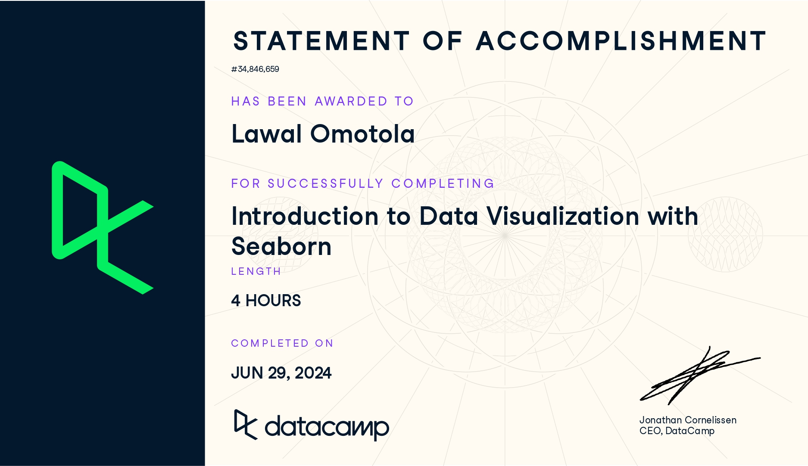

Completing the **Introduction to Data Visualization with Seaborn** course has strengthened my ability to explore and communicate data insights using clear, visually compelling plots. The lessons highlighted how Seaborn simplifies statistical graphics while integrating smoothly with pandas and Matplotlib.

---

## 1. Foundations of Seaborn

- Learned what **Seaborn** is and why it is useful for clean, statistical visualizations.
- Understood its advantages: simple syntax, strong integration with **pandas**, and flexibility inherited from **Matplotlib**.
- Reviewed Seaborn’s role in a typical analysis workflow, especially for **exploration and communication**.

---

## 2. Working With Data in Seaborn

- Loaded datasets directly from Seaborn and used **pandas DataFrames** for plotting.
- Mapped variables to **x**, **y**, **hue**, and **style** to create informative visuals.
- Explored how adding a **hue** variable reveals deeper patterns within the data.

---

## 3. Relational Plots and Subplots

- Created relational visualizations using `sns.relplot()` for **scatter** and **line** plots.
- Used `col`, `row`, and `col_order` to create **subplots** for grouped comparisons.
- Customized figure titles using `g.fig.suptitle()` and modified axes titles with `g.set()` and `g.set_title()`.

---

## 4. Categorical Plots

- Built **count plots**, **bar plots**, and **point plots** using `sns.catplot()`.
- Compared categorical groups such as age, gender, and ratings.
- Created point plots with customized **markers**, **hue**, and removed line joins for clarity.
- Used grouped bar and point plots to compare **medians** and other summary values.

---

## 5. Customization and Styling

- Adjusted **colors** using Seaborn palettes, Matplotlib names, and hex codes.
- Added **titles**, **labels**, and text annotations to improve storytelling.
- Managed subplot titles and dynamically formatted them using variable names.

---

## 6. Practical Applications Using Real Datasets

- Worked with datasets such as **tips**, **student performance**, and survey-style data.
- Demonstrated relationships such as:
  - total bill vs. tip  
  - age group vs. importance ratings  
  - smoking vs. median total bill
- Created grouped scatter plots, multi-category charts, and various statistical comparisons.

---

## 7. Overall Skill Development

- Strengthened the ability to convert datasets into clear visual insights.
- Enhanced proficiency in Seaborn’s high-level API along with Matplotlib customization.
- Developed confidence in producing publication-ready graphics for reports, dashboards, and web documentation.

Check [here](https://lawaloa.github.io/Intro_Seaborn/){target="_blank"} for details.